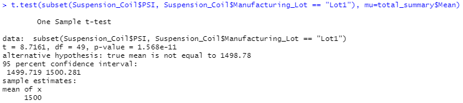

# MechaCar Statistical Analysis
The purpose of this project was to demonstrate different analytical techniques using R and statistical analysis to provide insights into what could be causing production and perfomrance issues for the MechaCar.  Specifically, the following statistics were evaluated:
1. Linear Regression to predict MPG
2. Summary Statistics on Suspension Coils
3. Summary Statistics on the Suspension Coils per Manufacturing Lot
4. t-Test on the PSI of Suspension Coils
5. t-Test on the PSI of Suspension Coils per Manufacturing Lot

## Linear Regression to Predict MPG
The results of the linear regression model to predict MPG were as follows.
- Ground clearance, vehicle length and the intercept all had Pr(<|t|) values smaller than the assumed 0.05% significance level, meaning that they provided non-random amounts of variance to the mpg values in the dataset. This means that ground clearance and vehicle length have a significant impact on mpg and the statistically significant y-intercept indicates that there are other significant variables and factors that were not included in the model.
- The null hypothesis for the linear regression model is that the slope will be equal to zero.  The p-value tells the likelihood that, if the null hypothesis is true, similar results would be seen if we tested our data again.  Because the p-value for the linear regression analysis was 5.35 x 10-11, which is much smaller than the assumed 0.05% significance level, there is sufficient evidence to reject the null hypothesis.  This means that the slope of the linear model is not equal to zero.
- The r-squared value (coefficient of determination) represents how well the regression model approximates real-world data points.  In this analysis, the r-squared value is 0.7149 which means about 71% of the MPG data will be correct using the linear model. Based on this analysis, it can be inferred that the linear model is effective in predicting mpg of MechaCar prototypes.

## Summary Statistics on Suspension Coils
The design specifications for the MechaCar suspension coils dictate that the variance of the suspension coils must not exceed 100 pounds per square inch.  Looking at the summary statistics on the full dataset, it appears that the current manufacturing data meets the design specification with a variance of 62 psi.  However, when looking at the summary statistics for each manugacturing lot, it is clear that Lots 1&2 meet the spec but Lot 3 exceeds the specification by 70 psi and consequently does not meet the specification. See the tables below.

|Total Summary|Lot Summary|
|:---:|:---:|
|||

## T-Tests on Suspension Coils
Below are the results of one-sample t-Tests conducted to determine if there is a statistically significant difference between the means of different sample datasets and the population dataset.  The first result compared the mean of a sample of 50 data points from the overall dataset to the population mean.  The next three results compared the means of the dataset for each lot to the population mean.  The null hypothesis for the t-Tests was that there would be no statistical difference between the means, while the alternative hypothesis assumed there would be a statistical difference between the means.  Looking at the results, it is seen that the p-values for Lot 1 and Lot 2 are much smaller than the assumed significance level of 0.05, meaning there is sufficient evidence to reject the null hypothesis.  This implies that those sample dataset means are statistically different from the population dataset mean.  For the sample data of all lots and Lot 3, the p-value was larger than the 0.05 significance level, meaning there is not sufficient evidence to reject the null hypothesis and the mean is statistically the same as the population mean.

- Sample data of all lots 

- Lot 1 

- Lot2 

- Lot 3 

## Study Design: MechaCar vs Competition
To compare the MechaCar fuel efficiency compared to competitor models, an addition study can be performed looking at the fuel efficiency of the MechaCar compared to similar models from different manufacturers.  Performing a statistical study will prepare the team to be better informed when making decisions regarding the MechaCar design and performance. 

**1. Metrics to be tested**
This study will be comparing the highway fuel efficiency performance of the MechaCar compared to similar competitor models.  The metric being analyzed will be miles per gallon, or mpg, and manufacturer name.

**2. Null and alternative hypotheses**
The null hypothesis in this study is that the fuel efficiency will be statistically consistent across each of the manufacturers.  The alternative hypothesis is that the fuel efficiency will be statistically inconsistent for at least one of the manufacturers.

**3. Statistical tests to be used to test the hypothesis**
To test the null hypothesis, a one-way ANOVA test will be used.  The ANOVA test is useful in this analysis since it can be used to test the means of the continuous numerical variable of highway fuel efficency (mpg) across different manufacturer groups.  The ANOVA test is preferred over a t-Test in this case for simplicity reasons. 

**4. Necessary data to run the statistical test**
The data needed for this analysis would be the highway fuel efficiencies, measured in mpg, of the MechaCar and other competitor models along with the name of the manufacturer for each model.  At least 50 fuel efficiency data points for each manufacturer would be needed to get an accurate representation of performance but a greater number of data points would improve the accuracy of the analysis.
