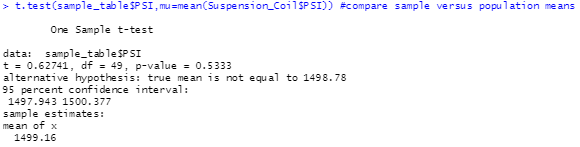
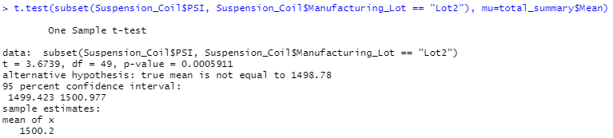

# MechaCar Statistical Analysis
The purpose of this project was to demonstrate different analytical techniques using R and statistical analysis to provide insights into what could be causing production and perfomrance issues for the MechaCar.  Specifically, the following statistics were evaluated:
1. Linear Regression to predict MPG
2. Summary Statistics on Suspension Coils
3. Summary Statistics on the Suspension Coils per Manufacturing Lot
4. t-Test on the PSI of Suspension Coils
5. t-Test on the PSI of Suspension Coils per Manufacturing Lot

## Linear Regression to Predict MPG
The results of the linear regression model to predict MPG were as follows.
- Ground clearance, vehicle length and the intercept all had Pr(<|t|) values smaller than the assumed 0.05% significance level, meaning that they provided non-random amounts of variance to the mpg values in the dataset. This means that ground clearance and vehicle length have a significant impact on mpg and the statistically significant y-intercept indicates that there are other significant variables and factors that were not included in the model.
- The null hypothesis for the linear regression model is that the slope will be equal to zero.  The p-value tells the likelihood that, if the null hypothesis is true, similar results would be seen if we tested our data again.  Because the p-value for the linear regression analysis was 5.35 x 10-11, which is much smaller than the assumed 0.05% significance level, there is insufficient evidence to reject the null hypothesis.  This means that the slope of the linear model is not equal to zero.
- The r-squared value (coefficient of determination) represents how well the regression model approximates real-world data points.  In this analysis, the r-squared value is 0.7149 which means about 71% of the MPG data will be correct using the linear model. Based on this analysis, it can be inferred that the linear model is effective in predicting mpg of MechaCar prototypes.

## Summary Statistics on Suspension Coils
The design specifications for the MechaCar suspension coils dictate that the variance of the suspension coils must not exceed 100 pounds per square inch.  Looking at the summary statistics on the full dataset, it appears that the current manufacturing data meets the design specification with a variance of 62 psi.  However, when looking at the summary statistics for each manugacturing lot, it is clear that Lots 1&2 meet the spec but Lot 3 exceeds the specification by 70 psi and consequently does not meet the specification. See the tables below.

|Total Summary|Lot Summary|
|:---:|:---:|
|||

## T-Tests on Suspension Coils
Below are the results of one-sample t-Tests conducted to determine if there is a statistically significant difference between the means of different sample datasets and the population dataset.  The first result compared the mean of a sample of 50 data points from the overall dataset to the population mean.  The next three results compared the means of the dataset for each lot to the population mean.  The null hypothesis for the t-Tests was that there would be no statistical difference between the means, while the alternative hypothesis assumed there would be a statistical difference between the means.  Looking at the results, it is seen that all of the p-values are much smaller than the assumed significance level of 0.05, meaning there is not enough evidenct to reject the null hypothesis.  This implies that all of the sample datasets are statistically similar to the population dataset.

## Study Design: MechaCar vs Competition

Write a short description of a statistical study that can quantify how the MechaCar performs against the competition. In your study design, think critically about what metrics would be of interest to a consumer: for a few examples, cost, city or highway fuel efficiency, horse power, maintenance cost, or safety rating.
In your description, address the following questions:
What metric or metrics are you going to test?
What is the null hypothesis or alternative hypothesis?
What statistical test would you use to test the hypothesis? And why?
What data is needed to run the statistical test?
